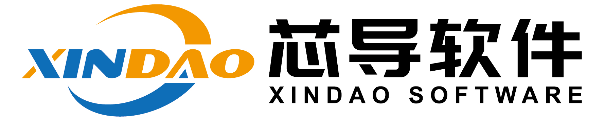
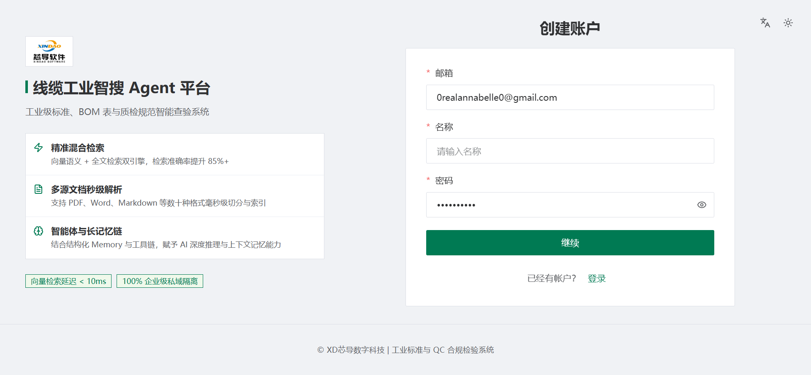

<div align="center">

<h1>芯导软件 | Wenruo RAG</h1>
<p><b>面向线缆工业的智能检索增强生成（RAG）系统</b></p>
<p>AI retrieval and question answering over cable standards, specifications, BOMs and QC records.</p>
</div>

<p align="center">
  <a href="./README.md"></a>
  <a href="./README_zh.md"></a>
  <a href="./LICENSE"></a>
</p>

<details open>
<summary><b>📕 Table of Contents</b></summary>

- 💡 [What is Wenruo RAG?](#-what-is-wenruo-rag)
- 🎮 [Get Started](#-get-started)
- 🔥 [Latest Updates](#-latest-updates)
- 🌟 [Key Features](#-key-features)
- 🔎 [System Architecture](#-system-architecture)
- 🎬 [Self-Hosting](#-self-hosting)
- 🔧 [Configurations](#-configurations)
- 🔧 [Build a Docker Image](#-build-a-docker-image)
- 🔨 [Launch Service from Source for Development](#-launch-service-from-source-for-development)
- 📚 [Documentation](#-documentation)
- 🙌 [Contributing](#-contributing)

</details>

## 💡 What is Wenruo RAG?

Wenruo RAG is an AI retrieval-augmented generation (RAG) engine purpose-built for the cable industry: a self-hosted retrieval and question-answering system that turns cable-domain material into a citation-grounded knowledge base.

It ingests what a cable business actually runs on — national and international standards, product specifications and datasheets, BOMs, test reports, QC records, process documentation, scanned drawings and web pages — and answers questions over them with traceable references instead of unverifiable prose.

The platform keeps the hardened pipeline of its upstream engine (deep document understanding and OCR, template-based chunking, hybrid keyword/vector retrieval with fused re-ranking, agent workflows, OpenAI-compatible APIs) and wraps it in an industrial cable workflow: datasets with per-file parsing configuration, chunk-level inspection, automatic keyword and question extraction, knowledge graphs, and agents that can call internal systems.

## 🎮 Get Started

Wenruo RAG is self-hosted. Pick the path that matches your goal:

- **Docker deployment or evaluation** — see [Self-Hosting](#-self-hosting).
- **Development from source (the standard flow for this repository)** — see [Launch Service from Source for Development](#-launch-service-from-source-for-development).

## 🔥 Latest Updates

- 2026-06-15 Support multiple chat channels such as Feishu, Discord, Telegram, Line, etc.
- 2026-04-24 Supports DeepSeek v4.
- 2025-12-26 Supports 'Memory' for AI agent.
- 2025-11-19 Supports Gemini 3 Pro.
- 2025-11-12 Supports data synchronization from Confluence, S3, Notion, Discord, Google Drive.
- 2025-10-23 Supports MinerU & Docling as document parsing methods.
- 2025-10-15 Supports orchestrable ingestion pipeline.
- 2025-08-08 Supports OpenAI's latest GPT-5 series models.
- 2025-08-01 Supports agentic workflow and MCP.
- 2025-05-23 Adds a Python/JavaScript code executor component to Agent.
- 2025-03-19 Supports using a multi-modal model to make sense of images within PDF or DOCX files.

## 🌟 Key Features

### 🍭 **"Quality in, quality out"**

- [Deep document understanding](./deepdoc/README.md)-based knowledge extraction from unstructured data with complicated
  formats.
- Finds "needle in a data haystack" of literally unlimited tokens.

### 🍱 **Template-based chunking**

- Intelligent and explainable.
- Plenty of template options to choose from.

### 🌱 **Grounded citations with reduced hallucinations**

- Visualization of text chunking to allow human intervention.
- Quick view of the key references and traceable citations to support grounded answers.

### 🍔 **Compatibility with heterogeneous data sources**

- Supports Word (including legacy `.doc` files via seamless PDF conversion), Slides, Excel, TXT, images, scanned copies, structured data, web pages, and more.
### 🛀 **Automated and effortless RAG workflow**

- Streamlined RAG orchestration catered to both personal and large businesses.
- Configurable LLMs as well as embedding models.
- Multiple recall paired with fused re-ranking.
- Intuitive APIs for seamless integration with business.

## 🔎 System Architecture

Wenruo RAG runs as a small stack behind a single nginx entry point:

- **Web UI** — the frontend bundle built into the image and served by nginx on port `80`.
- **API server** (`api/wenruo_server.py`) — the HTTP API on port `9380` and the admin API on port `9381`.
- **Task executor** (`rag/svr/task_executor.py`) — background workers that parse, OCR, chunk and index documents.
- **Document engine** — Elasticsearch by default; Infinity and OpenSearch are also supported for full-text and vector storage.
- **Metadata, objects and queues** — MySQL for metadata, MinIO for original files, Redis for queues and locks.

See [docs/](./docs) for the administrator, developer and reference guides.

## 🎬 Self-Hosting

### 📝 Prerequisites

- CPU >= 4 cores
- RAM >= 16 GB
- Disk >= 50 GB
- Docker >= 24.0.0 & Docker Compose >= v2.26.1
- Python >= 3.13 (for the from-source flow only)
- [gVisor](https://gvisor.dev/docs/user_guide/install/): required only if you intend to use the code executor (sandbox) feature.

> [!TIP]
> On Windows, Docker Desktop runs this stack inside a WSL2 VM. Size that VM before building images or running the
> document engine — for example in `%USERPROFILE%\.wslconfig`: `memory=10GB`, `processors=8`, `swap=8GB`, followed by
> `wsl --shutdown`. A VM that is too small makes container builds crawl in swap instead of failing fast.

### 🚀 Start up the server

1. On Linux hosts, ensure `vm.max_map_count` >= 262144 (Docker Desktop on Windows/macOS sets this inside its own VM):

   > To check the value of `vm.max_map_count`:
   >
   > ```bash
   > sysctl vm.max_map_count
   > ```
   >
   > Reset `vm.max_map_count` to a value at least 262144 if it is not.
   >
   > ```bash
   > # In this case, we set it to 262144:
   > sudo sysctl -w vm.max_map_count=262144
   > ```
   >
   > This change will be reset after a system reboot. To ensure your change remains permanent, add or update the
   > `vm.max_map_count` value in **/etc/sysctl.conf** accordingly:
   >
   > ```bash
   > vm.max_map_count=262144
   > ```
2. Clone this repository:

   ```bash
   git clone <YOUR_REPOSITORY_URL> wenruo-rag
   cd wenruo-rag
   ```
3. Build and start the application container:

   ```bash
   cd docker

   # Build the image (see "Build a Docker Image" for a faster, frontend-prebuilt build):
   docker compose build wenruo-rag-cpu

   # Start the application container:
   docker compose up -d wenruo-rag-cpu
   ```

   > The application container is named `wenruo-rag-cpu` and runs the image selected by `RAGFLOW_IMAGE` in
   > [.env](./docker/.env) — `my-wenruorag:latest` by default. Its dependency containers
   > (`wenruo-rag-mysql-1`, `wenruo-rag-es01-1`, `wenruo-rag-minio-1`, `wenruo-rag-redis-1`) must already be running.
   > On a cold machine, start the whole stack instead:
   >
   > ```bash
   > docker compose up -d
   > ```
4. Check the server status:

   ```bash
   docker logs -f wenruo-rag-cpu
   ```

   _The following output confirms a successful launch of the system:_

   ```bash
                         Wenruo RAG Engine                   

   Wenruo RAG version: v0.27.1-<git-describe>
   project base: /wenruo-rag
   Wenruo RAG server is ready after 131.1s initialization.
   Running on http://0.0.0.0:9380 (CTRL + C to quit)
   ```

   > The version suffix is the `git describe` output of the build you are running. The first start takes longer
   > because the database tables, indexes and superuser are provisioned before the API starts listening.
   >
   > If you skip this confirmation step and log in too early, your browser may report a `network abnormal` error
   > because the API is not fully initialized yet.
   >
5. In your web browser, enter the IP address of your server and log in:

   > With the default settings, you only need to enter `http://IP_OF_YOUR_MACHINE` (**sans** port number), as the
   > default HTTP serving port `80` can be omitted.
   >
6. In [service_conf.yaml.template](./docker/service_conf.yaml.template), select the desired LLM factory in
   `user_default_llm` and update the `API_KEY` field with the corresponding API key.

   > Wenruo RAG ships as the slim edition and includes no embedding models, so also configure an embedding model
   > provider before creating datasets. See [docs/](./docs) for configuration guides.
   >

   _The show is on!_

## 🔧 Configurations

When it comes to system configurations, you will need to manage the following files:

- [.env](./docker/.env): Keeps the fundamental setups for the system, such as `COMPOSE_PROJECT_NAME`,
  `RAGFLOW_IMAGE`, `SVR_HTTP_PORT`, `MYSQL_PASSWORD`, and `MINIO_PASSWORD`.
- [service_conf.yaml.template](./docker/service_conf.yaml.template): Configures the back-end services. The environment variables in this file will be automatically populated when the Docker container starts. Any environment variables set within the Docker container will be available for use, allowing you to customize service behavior based on the deployment environment.
- [docker-compose.yml](./docker/docker-compose.yml): The system relies on [docker-compose.yml](./docker/docker-compose.yml) to start up.

> The [./docker/README](./docker/README.md) file provides a detailed description of the environment settings and service
> configurations which can be used as `${ENV_VARS}` in the [service_conf.yaml.template](./docker/service_conf.yaml.template) file.

To update the default HTTP serving port (80), go to [docker-compose.yml](./docker/docker-compose.yml) and change `80:80`
to `<YOUR_SERVING_PORT>:80`.

Updates to the above configurations require a restart of the application container to take effect:

> ```bash
> cd docker
> docker compose up -d wenruo-rag-cpu
> ```

### Switch doc engine from Elasticsearch to Infinity

Wenruo RAG uses Elasticsearch by default for storing full text and vectors. To switch to Infinity, follow these steps:

1. Stop all running containers:

   ```bash
   docker compose -f docker/docker-compose.yml down -v
   ```

> [!WARNING]
> `-v` will delete the docker container volumes, and the existing data will be cleared.

2. Set `DOC_ENGINE` in **docker/.env** to `infinity`.
3. Start the containers:

   ```bash
   docker compose -f docker/docker-compose.yml up -d
   ```

> [!WARNING]
> Switching to Infinity on a Linux/arm64 machine is not yet officially supported.

## 🔧 Build a Docker Image

The application image is built from the [Dockerfile](./Dockerfile) in this repository and tagged with
`RAGFLOW_IMAGE` from [docker/.env](./docker/.env) (`my-wenruorag:latest`).

**Fastest build — prebuilt frontend.** Build `web/dist` on the host, then let the image ship it instead of running a
Vite build inside the container:

```bash
# 1. Build the frontend on the host (the container build reads web/dist from the build context):
cd web
npm run build
cd ..

# 2. Build the image with the prebuilt frontend:
cd docker
docker compose build --build-arg WEB_DIST_MODE=prebuilt wenruo-rag-cpu
```

> Prefer this route on machines with a small Docker VM: the in-container Vite build of this monorepo is memory
> hungry. `WEB_BUILD_HEAP_MB` (default `4096`) caps the V8 heap for the in-container build and must stay below the
> memory the Docker VM can actually back with RAM.

**Full in-container build** (frontend compiled inside the image):

```bash
cd docker
docker compose build wenruo-rag-cpu
```

> Both routes need the dependency image that bundles the models and native libraries. It is built from this
> repository and can be recreated at any time without network access:
>
> ```bash
> cd wenruo_deps
> docker build -f Dockerfile -t infiniflow/wenruo_deps:latest .
> ```

## 🔨 Launch Service from Source for Development

This repository is developed and run on Windows with PowerShell. Use the flow below as the standard
local startup procedure, and keep the Docker dependencies running in the background.

> [!TIP]
> **Legacy Office Preview (.doc):**
> Docker images automatically come with headless LibreOffice pre-installed for converting legacy `.doc` documents into PDF previews.
> For local source development, if you need to test `.doc` preview natively, install LibreOffice on your host machine and set the `SOFFICE_BIN` environment variable pointing to the `soffice` executable.

> [!IMPORTANT]
> After cloning the repository for the first time, run `git config --local --unset core.hooksPath`, `uv tool install lefthook` and `lefthook install` once from the repo root to enable local Git hooks.

### First-time setup

1. Install `uv`, or skip this step if it is already installed:

   ```powershell
   pipx install uv
   ```

2. Install the Python dependencies and download the native libraries:

   ```powershell
   uv sync --python 3.13
   uv run python wenruo_deps/download_deps.py
   ```

3. Install the frontend dependencies:

   ```powershell
   cd web
   npm install
   ```

### Start the services

1. Make sure the Docker dependency containers are running: `docker ps` should list `wenruo-rag-mysql-1`,
   `wenruo-rag-es01-1`, `wenruo-rag-redis-1` and `wenruo-rag-minio-1`. If they are not running, start them
   now and skip this step next time:

   ```powershell
   docker compose -f docker/docker-compose-base.yml up -d
   ```

2. Terminal 1 — task executor, the background worker that parses and indexes documents:

   ```powershell
   $env:PYTHONPATH="."
   $env:HF_ENDPOINT="https://hf-mirror.com"
   $env:PYTHONUTF8="1"
   uv run python rag/svr/task_executor.py
   ```

3. Terminal 2 — Web API service, listening on port 9380:

   ```powershell
   $env:PYTHONPATH="."
   $env:HF_ENDPOINT="https://hf-mirror.com"
   $env:PYTHONUTF8="1"
   uv run python api/ragflow_server.py
   ```

4. Terminal 3 — frontend UI, serving <http://localhost:9222> and proxying the API:

   ```powershell
   cd web
   npm run dev
   ```
   

   | Frontend (dev) | API proxy target | Purpose |
   |----------------|------------------|---------|
   | `http://localhost:9222` | `http://127.0.0.1:9380` | `/api`, `/v1` — application API served by `api/wenruo_server.py` |
   | `http://localhost:9222` | `http://127.0.0.1:9381` | `/api/v1/admin` — admin API served by the same process |

5. Open <http://localhost:9222> to use Wenruo RAG:

   Wait for the console banner shown in [Self-Hosting](#-self-hosting) (or the equivalent lines in
   `logs/ragflow_server.log`) before the first request: the Web API binds port 9380 only after the database and
   document engine are ready.

   `$env:PYTHONUTF8="1"` keeps Chinese log output from breaking the console code page, and
   `$env:HF_ENDPOINT="https://hf-mirror.com"` points model downloads at the HuggingFace mirror.

### Stop the services

Press `Ctrl+C` in each terminal. The Docker dependencies keep running until you run
`docker compose -f docker/docker-compose-base.yml down`.

On Linux or macOS, replace the `$env:X="..."` lines with `export X=...`; there
`bash docker/launch_backend_service.sh` starts both backend processes in a single terminal.

## 📚 Documentation

- [docs/](./docs) — administrator, developer, guide and reference documentation shipped with this repository.
- [docker/README.md](./docker/README.md) — environment variables and service configuration used by `service_conf.yaml.template`.
- [deepdoc/README.md](./deepdoc/README.md) — the deep document understanding and OCR pipeline.
- [internal/development.md](./internal/development.md) — native and Go build notes.
- [AGENTS.md](./AGENTS.md) — repository conventions and validation expectations for changes.

## 🙌 Contributing

This repository is a private downstream customization. Keep changes small and local, validate them with the narrowest
relevant command (see [AGENTS.md](./AGENTS.md)), and prefer deleting superseded code over keeping compatibility
shims. For frontend work, follow [web/CLAUDE.md](./web/CLAUDE.md).
